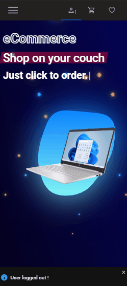

# eCommerce App fullStack

deployed with github pages [DEMO LINK](https://pavel-gutsal.github.io/web-Shop-frontend/)

## backend:
  * `nest.js` framework
  * `MongoDB` and `mongoose`
  * `class validator` --> decorator based validation of clients requests
  * `JsonWebToken` --> user authentification

## frontend: 
  * `Redux Toolkit` --> state management
  * `Tanstack/Query` --> server side state management
  * `Styled components` --> css management 🙃
  * `Matirial UI` --> ui library
  * `Formik and yup` --> form management
  * `Stripe` --> payment management

backend API = https://web-shop-backend-2.onrender.com

backend source code = https://github.com/pavel-gutsal/web-shop-backend

home page demo

catalogue page demo

product page demo

registration demo

stripe demo

smartphone/responsice layout demo

